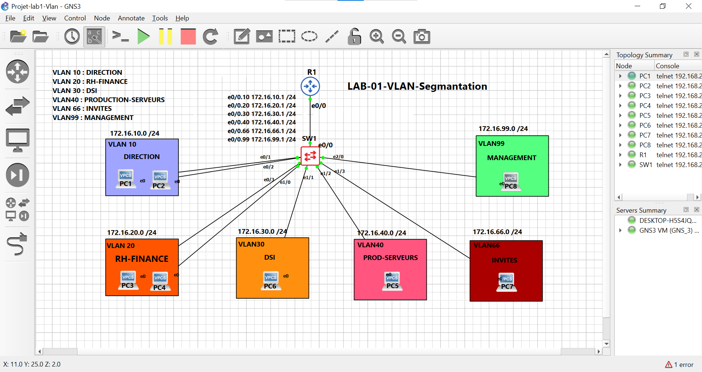

# Lab 01 — Segmentation VLAN pour NovaTech

## Contexte

NovaTech déménage dans de nouveaux locaux et passe de 15 à 60 employés répartis en 5 pôles :
Direction, RH-Finance, IT-Dev, Production-Serveurs, et invités (Wifi visiteurs).

Le réseau actuel est plat (`192.168.1.0/24`) : tous les postes partagent le même domaine de
broadcast, sans aucun cloisonnement. Cela pose un risque de sécurité (les invités peuvent
atteindre les serveurs de production) et un problème de performance (broadcast storm potentiel
à mesure que le nombre de postes augmente).

## Objectif

Concevoir, adresser et déployer une architecture réseau segmentée en VLANs, avec un routage
inter-VLAN contrôlé par une matrice de flux stricte appliquée via des ACLs.

## Topologie



Un routeur en *router-on-a-stick* (une sous-interface 802.1Q par VLAN) relié en trunk à un
switch manageable (Cisco IOSvL2). Chaque VLAN correspond à un pôle de l'entreprise.

| VLAN | Rôle                 | Sous-réseau        |
|------|----------------------|---------------------|
| 10   | Direction            | 172.16.10.0/24      |
| 20   | RH-Finance           | 172.16.20.0/24      |
| 30   | IT-Dev               | 172.16.30.0/24      |
| 40   | Production-Serveurs  | 172.16.40.0/24      |
| 66   | Invités (isolé)      | 172.16.66.0/24      |
| 99   | Management           | 172.16.99.0/24      |

Détail complet du plan d'adressage : voir [`docs/plan-adressage.md`](docs/plan-adressage.md).

## Matrice de flux

| Source \ Destination | Direction | RH-Finance | IT-Dev | Prod-Serveurs | Invités | Management |
|-----------------------|:---:	   |:---:       |:---:   |:---:          |:---:    |:---:       |
| Direction             |  —       |  ✅        |  ✅    |  ✅           |  ❌     |  ✅        |
| RH-Finance            |  ✅      |  —         | ⚠️ TCP/443 |  ✅       |  ❌     |  ❌        |
| IT-Dev                |  ✅      | ⚠️ TCP/443 |  —     |  ✅           |  ❌     |  ✅        |
| Prod-Serveurs         |  ✅      |  ✅        |  ✅    |  —            |  ❌     |  ❌        |
| Invités               |  ❌      |  ❌        |  ❌    |  ❌           |  —      |  ❌        |
| Management            |  ✅      |  ❌        |  ✅    |  ❌           |  ❌     |  —         |

Justification détaillée de chaque règle : voir [`docs/matrice-de-flux.md`](docs/matrice-de-flux.md).

## Outils utilisés

- GNS3
- Switch Cisco IOSvL2 (SW1) et routeur Cisco IOS (R1)
- PuTTY (accès CLI)
- Wireshark (analyse de trafic)

## Tâches réalisées

- [x] Plan d'adressage détaillé (voir docs/plan-adressage.md)
- [x] Création des VLANs sur le switch
- [x] Configuration du port trunk switch ↔ routeur (802.1Q)
- [x] Sous-interfaces 802.1Q sur le routeur (router-on-a-stick)
- [x] Tests de connectivité intra-VLAN et inter-VLAN (avant ACL)
- [x] 6 ACLs extended posées sur R1, une par VLAN, appliquées en  <<in>>
- [x] Validation de la matrice de flux par tests de ping + compteurs << show access-lists >>
- [ ] Test du flux TCP/443 avec un vrai client TCP (limite de VPCS — voir note ci-dessous)

## Note sur la validation du port TCP/443

VPCS (les hôtes simulés dans GNS3) ne génère que de l'ICMP/ARP/DHCP, pas de trafic TCP. Le
flux RH-Finance → IT-Dev sur le port 443 a donc été validé indirectement :
- Le blocage de tout le reste du trafic (ping) entre ces deux VLANs a été confirmé.
- Les compteurs `show access-lists` sur la ligne `permit tcp ... eq 443` servent de preuve
  que la règle est active et correctement positionnée dans l'ACL.
- Un test avec un vrai hôte (VM Linux + `netcat`) est identifié comme amélioration possible
  mais n'a pas été jugé bloquant pour la validation de ce lab.

## Structure du dépôt

```
lab-01-vlan-segmentation/
├── README.md
├── docs/
│   ├── plan-adressage.md
│   ├── matrice-de-flux.md
│   └── topologie.png
├── configs/
│   ├── routeur-r1.cfg
│   ├── switch-sw1.cfg
│   └── switch-sw1-vlans.txt
└── tests/
    └── resultats-tests.md
```

## Statut

🟢 Terminé — démarré le 09/09/2026, finalisé le 19/09/2026.
